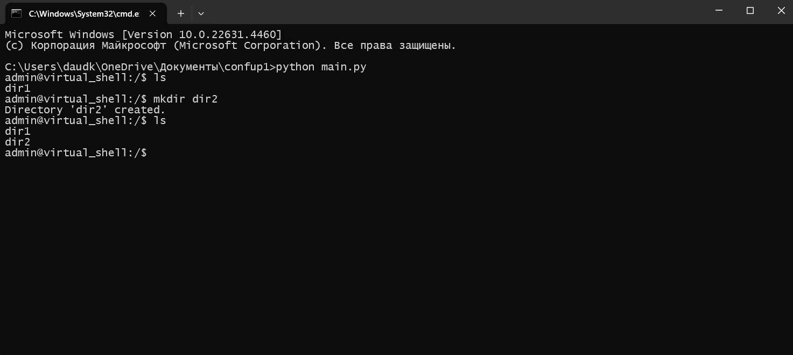
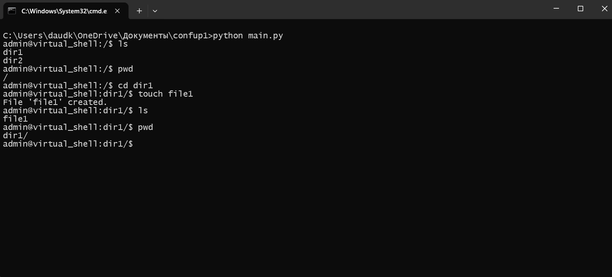
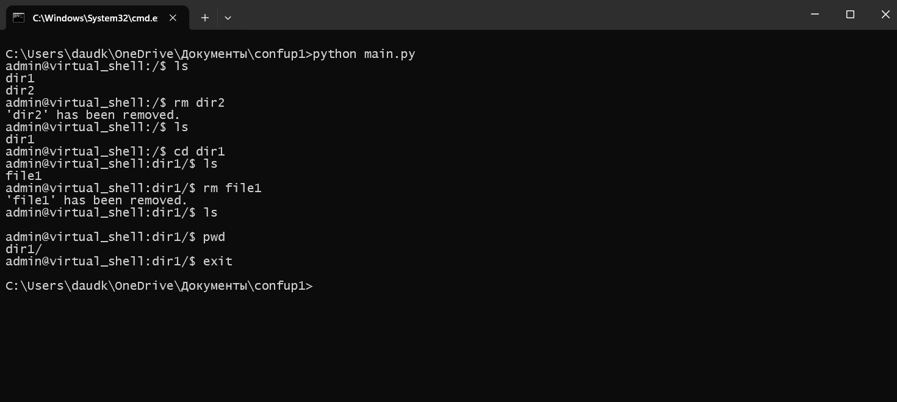

# Вариант "5" Группа икбо 78 - 23
# Задания

Разработать эмулятор для языка оболочки ОС. Необходимо сделать работу 
эмулятора как можно более похожей на сеанс shell в UNIX-подобной ОС. 
Эмулятор должен запускаться из реальной командной строки, а файл с 
виртуальной файловой системой не нужно распаковывать у пользователя. 
Эмулятор принимает образ виртуальной файловой системы в виде файла формата 
tar. Эмулятор должен работать в режиме CLI. 
Ключами командной строки задаются: 
• Имя пользователя для показа в приглашении к вводу. 
• Имя компьютера для показа в приглашении к вводу. 
• Путь к архиву виртуальной файловой системы. 
Необходимо поддержать в эмуляторе команды ls, cd и exit, а также 
следующие команды: 
1. rm. 
2. touch. 
3. mkdir. 
Все функции эмулятора должны быть покрыты тестами, а для каждой из 
поддерживаемых команд необходимо написать 2 теста. 
# Примеры работы
## Тест 1

### демонстрирует работу  комманд 
- ls
- cd
- mkdir

## Тест 2

### демонстрирует работу  комманд 
- ls
- cd
- touch
- pwd

## Тест 3

### демонстрирует работу  комманд 
- ls 
- rm 
- cd 
- pwd 
- exit

# Тестирование
при запуске test мы видим результат
```
pwd test 1 passed
pwd test 2 passed
ls test 1 passed
ls test 2 passed
rm test 1 passed
rm test 2 passed
cd test 1 passed
cd test 2 passed
cd test 3 passed
touch test 1 passed
touch test 2 passed
mkdir test 1 passed
mkdir test 2 passed
```
все тесты пройденный успешно

